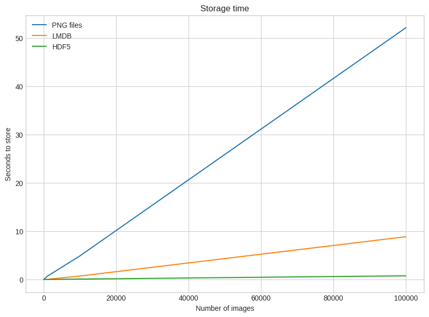
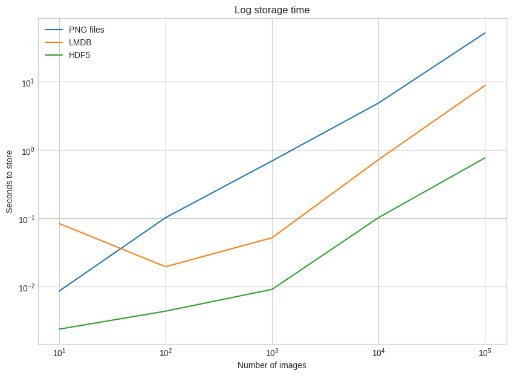
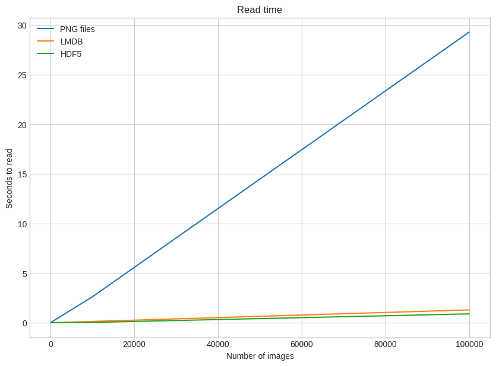
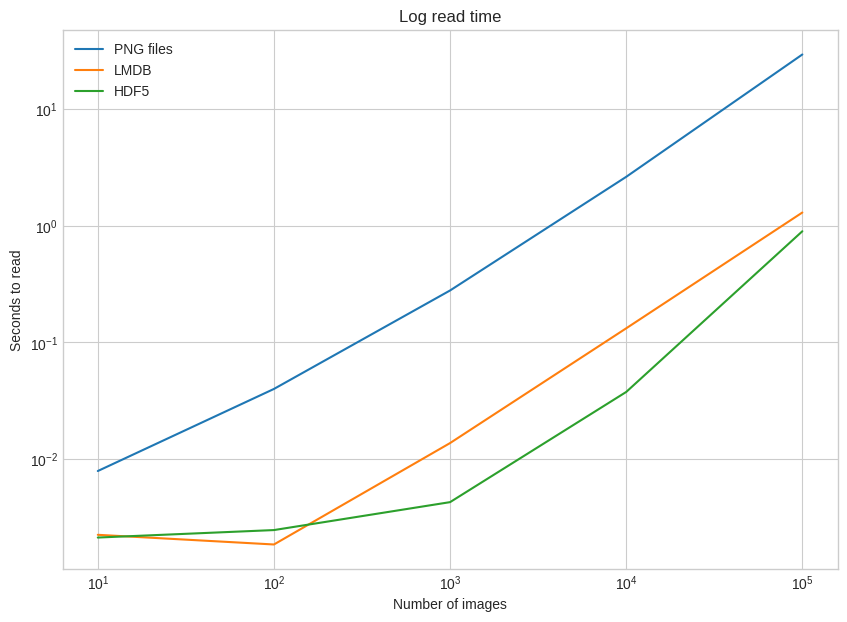
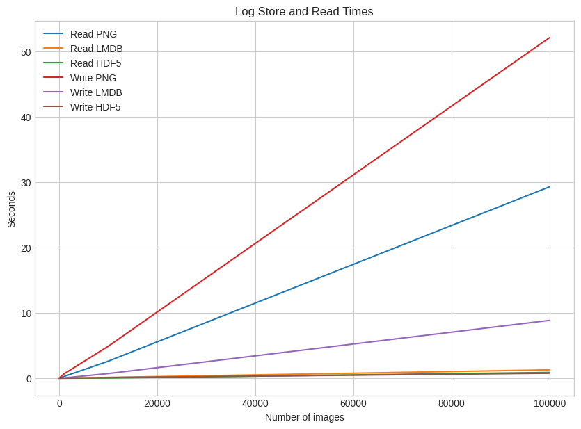

```python
!pip install Pillow
```

    Requirement already satisfied: Pillow in /usr/local/lib/python3.10/dist-packages (9.4.0)
    


```python
!pip install lmdb
```

    Collecting lmdb
      Downloading lmdb-1.4.1-cp310-cp310-manylinux_2_17_x86_64.manylinux2014_x86_64.whl (299 kB)
         ━━━━━━━━━━━━━━━━━━━━━━━━━━━━━━━━━━━━━━━━ 299.2/299.2 kB 4.3 MB/s eta 0:00:00
    [?25hInstalling collected packages: lmdb
    Successfully installed lmdb-1.4.1
    


```python
!pip install h5py
```

    Requirement already satisfied: h5py in /usr/local/lib/python3.10/dist-packages (3.9.0)
    Requirement already satisfied: numpy>=1.17.3 in /usr/local/lib/python3.10/dist-packages (from h5py) (1.25.2)
    


```python
import numpy as np
import pickle
from pathlib import Path

# Path to the unzipped CIFAR data
data_dir = Path("/content/data/cifar-10-batches-py/")

# Unpickle function provided by the CIFAR hosts
def unpickle(file):
    with open(file, "rb") as fo:
        dict = pickle.load(fo, encoding="bytes")
    return dict

images, labels = [], []
for batch in data_dir.glob("data_batch_*"):
    batch_data = unpickle(batch)
    for i, flat_im in enumerate(batch_data[b"data"]):
        im_channels = []
        # Each image is flattened, with channels in order of R, G, B
        for j in range(3):
            im_channels.append(
                flat_im[j * 1024 : (j + 1) * 1024].reshape((32, 32))
            )
        # Reconstruct the original image
        images.append(np.dstack((im_channels)))
        # Save the label
        labels.append(batch_data[b"labels"][i])

print("Loaded CIFAR-10 training set:")
print(f" - np.shape(images)     {np.shape(images)}")
print(f" - np.shape(labels)     {np.shape(labels)}")
```

    Loaded CIFAR-10 training set:
     - np.shape(images)     (50000, 32, 32, 3)
     - np.shape(labels)     (50000,)
    

Memuat set pelatihan CIFAR-10 yang berisi 50.000 gambar dengan dimensi 32x32 piksel dan 3 saluran warna (RGB). Ini adalah format umum dari dataset CIFAR-10 di mana setiap gambar adalah gambar berwarna dengan ukuran yang relatif kecil.


```python
# Storing a Single Image

from pathlib import Path

disk_dir = Path("/content/data/disk/")
lmdb_dir = Path("/content/data/lmdb/")
hdf5_dir = Path("/content/data/hdf5/")
```

 Mendefinisikan tiga variabel: disk_dir, lmdb_dir, dan hdf5_dir, yang masing-masing merepresentasikan direktori di mana akan menyimpan gambar dalam format yang berbeda (disk, LMDB, HDF5).


```python
disk_dir.mkdir(parents=True, exist_ok=True)
lmdb_dir.mkdir(parents=True, exist_ok=True)
hdf5_dir.mkdir(parents=True, exist_ok=True)
```

 Membuat direktori yang ditentukan dalam variabel disk_dir, lmdb_dir, dan hdf5_dir.


```python
# Storing to Disk

from PIL import Image
import csv

def store_single_disk(image, image_id, label):
    """ Stores a single image as a .png file on disk.
        Parameters:
        ---------------
        image       image array, (32, 32, 3) to be stored
        image_id    integer unique ID for image
        label       image label
    """
    Image.fromarray(image).save(disk_dir / f"{image_id}.png")

    with open(disk_dir / f"{image_id}.csv", "wt") as csvfile:
        writer = csv.writer(
            csvfile, delimiter=" ", quotechar="|", quoting=csv.QUOTE_MINIMAL
        )
        writer.writerow([label])
```

Pada umumnya, informasi metadata juga perlu dipertimbangkan saat menyimpan gambar. Dalam dataset contoh kita, metadata yang dimaksud adalah label gambar. Ketika menyimpan gambar ke dalam media penyimpanan, ada beberapa opsi untuk menyimpan metadata tersebut.

Salah satu solusinya adalah dengan memasukkan label ke dalam nama gambar itu sendiri. Ini memiliki keuntungan karena tidak memerlukan file tambahan.

Namun, kelemahannya adalah saat  ingin berinteraksi dengan label saja tanpa harus memuat gambar, harus berurusan dengan semua file tersebut. Dengan menyimpan label dalam file terpisah, dapat mengelola label secara terpisah tanpa harus memuat gambar. Seperti yang telah saya lakukan di atas, saya menyimpan label dalam file .csv terpisah untuk eksperimen ini.

Sekarang, mari kita lanjutkan dengan melakukan tugas yang sama menggunakan LMDB.


```python
# Storing to LMDB

class CIFAR_Image:
    def __init__(self, image, label):
        # Dimensions of image for reconstruction - not really necessary
        # for this dataset, but some datasets may include images of
        # varying sizes
        self.channels = image.shape[2]
        self.size = image.shape[:2]

        self.image = image.tobytes()
        self.label = label

    def get_image(self):
        """ Returns the image as a numpy array. """
        image = np.frombuffer(self.image, dtype=np.uint8)
        return image.reshape(*self.size, self.channels)
```

Dua hal penting tentang LMDB adalah penggunaan memori yang harus ditentukan sebelumnya karena LMDB menggunakan pemetaan memori, dan operasi baca-tulis dilakukan dalam transaksi.

Pertama, ukuran memori yang akan digunakan oleh LMDB harus ditentukan sebelumnya. Hal ini relatif mudah dalam kasus kita saat ini, tetapi bisa menjadi masalah besar dalam kasus lain, yang akan dibahas lebih mendalam di bagian selanjutnya. LMDB menyebut variabel ini sebagai map_size.

Kedua, operasi baca dan tulis dengan LMDB dilakukan dalam transaksi. Anda dapat menganggapnya mirip dengan operasi pada basis data tradisional, yang terdiri dari sekelompok operasi pada basis data. Hal ini mungkin terlihat lebih rumit daripada versi disk, tetapi teruslah membaca!


```python
import lmdb
import pickle

def store_single_lmdb(image, image_id, label):
    """ Stores a single image to a LMDB.
        Parameters:
        ---------------
        image       image array, (32, 32, 3) to be stored
        image_id    integer unique ID for image
        label       image label
    """
    map_size = image.nbytes * 10

    # Create a new LMDB environment
    env = lmdb.open(str(lmdb_dir / f"single_lmdb"), map_size=map_size)

    # Start a new write transaction
    with env.begin(write=True) as txn:
        # All key-value pairs need to be strings
        value = CIFAR_Image(image, label)
        key = f"{image_id:08}"
        txn.put(key.encode("ascii"), pickle.dumps(value))
    env.close()
```

Menghitung jumlah byte yang diperlukan untuk setiap pasangan kunci-nilai adalah ide bagus.

Dengan dataset gambar berbagai ukuran, akan menjadi perkiraan, tetapi dapat menggunakan sys.getsizeof() untuk mendapatkan perkiraan yang masuk akal. Perlu diingat bahwa sys.getsizeof(CIFAR_Image) hanya akan mengembalikan ukuran definisi kelas, yaitu 1056, bukan ukuran objek yang sudah di-instantiasi.

Fungsi ini juga tidak dapat sepenuhnya menghitung item bersarang, daftar, atau objek yang berisi referensi ke objek lain.

Alternatifnya, Anda dapat menggunakan pympler untuk menghemat perhitungan dengan menentukan ukuran tepat sebuah objek.


```python
# Storing With HDF5

import h5py

def store_single_hdf5(image, image_id, label):
    """ Stores a single image to an HDF5 file.
        Parameters:
        ---------------
        image       image array, (32, 32, 3) to be stored
        image_id    integer unique ID for image
        label       image label
    """
    # Create a new HDF5 file
    file = h5py.File(hdf5_dir / f"{image_id}.h5", "w")

    # Create a dataset in the file
    dataset = file.create_dataset(
        "image", np.shape(image), h5py.h5t.STD_U8BE, data=image
    )
    meta_set = file.create_dataset(
        "meta", np.shape(label), h5py.h5t.STD_U8BE, data=label
    )
    file.close()
```

  Membuat dataset 'image' untuk menyimpan data gambar dan grup 'metadata' untuk menyimpan metadata gambar. Metadata disimpan sebagai atribut dari grup 'metadata' dalam format yang dapat disimpan oleh HDF5. h5py.h5t.STD_U8BE adalah jenis data yang akan disimpan dalam dataset, dalam hal ini adalah bilangan bulat tidak bertanda 8-bit dalam format big-endian. Ini berguna saat menentukan jenis data untuk dataset dalam file HDF5, karena membantu memastikan kompatibilitas dan konsistensi dalam cara data disimpan dan diakses.


```python
# Experiments for Storing a Single Image

_store_single_funcs = dict(
    disk=store_single_disk, lmdb=store_single_lmdb, hdf5=store_single_hdf5
)
```

Pada tahap ini Ini memungkinkan untuk dengan mudah beralih antara metode penyimpanan yang berbeda dalam percobaan tanpa perlu mengubah banyak bagian kode secara manual.


```python
from timeit import timeit

store_single_timings = dict()

for method in ("disk", "lmdb", "hdf5"):
    t = timeit(
        "_store_single_funcs[method](image, 0, label)",
        setup="image=images[0]; label=labels[0]",
        number=1,
        globals=globals(),
    )
    store_single_timings[method] = t
    print(f"Method: {method}, Time usage: {t}")
```

    Method: disk, Time usage: 0.023662465000029442
    Method: lmdb, Time usage: 0.009727621999900293
    Method: hdf5, Time usage: 0.004374753999968561
    

Output menunjukkan waktu penggunaan untuk tiga metode yang berbeda:

1. Method: disk, Time usage: 0.023662465000029442
2. Method: lmdb, Time usage: 0.009727621999900293
3. Method: hdf5, Time usage: 0.004374753999968561

Setiap baris memiliki format yang sama dengan menunjukkan nama metode (disk, lmdb, hdf5) diikuti oleh waktu penggunaan metode tersebut dalam detik.

- Waktu penggunaan untuk metode "disk" adalah sekitar 0.024 detik.
- Waktu penggunaan untuk metode "lmdb" adalah sekitar 0.010 detik.
- Waktu penggunaan untuk metode "hdf5" adalah sekitar 0.004 detik.

Dari perbandingan waktu ini, terlihat bahwa metode "hdf5" adalah yang paling cepat, diikuti oleh metode "lmdb", dan metode "disk" memiliki waktu penggunaan yang paling lambat di antara ketiganya. Hal ini menunjukkan bahwa metode "hdf5" merupakan pilihan yang lebih efisien dalam hal waktu penggunaan untuk menyimpan dan mengelola data gambar dalam format yang digunakan.


```python
# Storing Many Images
## Adjusting the Code for Many Images

def store_many_disk(images, labels):
    """ Stores an array of images to disk
        Parameters:
        ---------------
        images       images array, (N, 32, 32, 3) to be stored
        labels       labels array, (N, 1) to be stored
    """
    num_images = len(images)

    # Save all the images one by one
    for i, image in enumerate(images):
        Image.fromarray(image).save(disk_dir / f"{i}.png")

    # Save all the labels to the csv file
    with open(disk_dir / f"{num_images}.csv", "w") as csvfile:
        writer = csv.writer(
            csvfile, delimiter=" ", quotechar="|", quoting=csv.QUOTE_MINIMAL
        )
        for label in labels:
            # This typically would be more than just one value per row
            writer.writerow([label])

def store_many_lmdb(images, labels):
    """ Stores an array of images to LMDB.
        Parameters:
        ---------------
        images       images array, (N, 32, 32, 3) to be stored
        labels       labels array, (N, 1) to be stored
    """
    num_images = len(images)

    map_size = num_images * images[0].nbytes * 10

    # Create a new LMDB DB for all the images
    env = lmdb.open(str(lmdb_dir / f"{num_images}_lmdb"), map_size=map_size)

    # Same as before — but let's write all the images in a single transaction
    with env.begin(write=True) as txn:
        for i in range(num_images):
            # All key-value pairs need to be Strings
            value = CIFAR_Image(images[i], labels[i])
            key = f"{i:08}"
            txn.put(key.encode("ascii"), pickle.dumps(value))
    env.close()

def store_many_hdf5(images, labels):
    """ Stores an array of images to HDF5.
        Parameters:
        ---------------
        images       images array, (N, 32, 32, 3) to be stored
        labels       labels array, (N, 1) to be stored
    """
    num_images = len(images)

    # Create a new HDF5 file
    file = h5py.File(hdf5_dir / f"{num_images}_many.h5", "w")

    # Create a dataset in the file
    dataset = file.create_dataset(
        "images", np.shape(images), h5py.h5t.STD_U8BE, data=images
    )
    meta_set = file.create_dataset(
        "meta", np.shape(labels), h5py.h5t.STD_U8BE, data=labels
    )
    file.close()
```

Dengan menggunakan fungsi-fungsi pada code, dapat dengan mudah menyimpan banyak gambar dengan label yang sesuai ke dalam tiga format penyimpanan yang berbeda, yaitu disk, LMDB, dan HDF5.


```python
# Preparing the Dataset

cutoffs = [10, 100, 1000, 10000, 100000]

# Let's double our images so that we have 100,000
images = np.concatenate((images, images), axis=0)
labels = np.concatenate((labels, labels), axis=0)

# Make sure you actually have 100,000 images and labels
print(np.shape(images))
print(np.shape(labels))
```

    (100000, 32, 32, 3)
    (100000,)
    

Output menunjukkan bahwa sekarang array images yang berukuran (100000, 32, 32, 3) yang menunjukkan 100.000 gambar dengan dimensi 32x32 piksel dan 3 saluran warna, serta array labels yang berukuran (100000,) yang berisi 100.000 label yang sesuai dengan masing-masing gambar.


```python
# Experiment for Storing Many Images

_store_many_funcs = dict(
    disk=store_many_disk, lmdb=store_many_lmdb, hdf5=store_many_hdf5
)

from timeit import timeit

store_many_timings = {"disk": [], "lmdb": [], "hdf5": []}

for cutoff in cutoffs:
    for method in ("disk", "lmdb", "hdf5"):
        t = timeit(
            "_store_many_funcs[method](images_, labels_)",
            setup="images_=images[:cutoff]; labels_=labels[:cutoff]",
            number=1,
            globals=globals(),
        )
        store_many_timings[method].append(t)

        # Print out the method, cutoff, and elapsed time
        print(f"Method: {method}, Time usage: {t}")
```

    Method: disk, Time usage: 0.008646438000027956
    Method: lmdb, Time usage: 0.08454583500008539
    Method: hdf5, Time usage: 0.002400706999992508
    Method: disk, Time usage: 0.10295578800003113
    Method: lmdb, Time usage: 0.01968983499989463
    Method: hdf5, Time usage: 0.004401658000006137
    Method: disk, Time usage: 0.6970701410000402
    Method: lmdb, Time usage: 0.05230857900005503
    Method: hdf5, Time usage: 0.009182623000015155
    Method: disk, Time usage: 4.905532293999954
    Method: lmdb, Time usage: 0.7275683199999321
    Method: hdf5, Time usage: 0.10295688500002598
    Method: disk, Time usage: 52.101050725999926
    Method: lmdb, Time usage: 8.860374152999952
    Method: hdf5, Time usage: 0.7734063059999698
    

Hasil eksperimen menunjukkan waktu penggunaan untuk setiap metode penyimpanan (disk, LMDB, HDF5) dengan jumlah gambar yang berbeda berdasarkan nilai-nilai dalam cutoffs. Berikut adalah ringkasan hasilnya:

1. Cutoff: 10
- Method: disk, Time usage: 0.008646438000027956
- Method: lmdb, Time usage: 0.08454583500008539
- Method: hdf5, Time usage: 0.002400706999992508
2. Cutoff: 100
- Method: disk, Time usage: 0.10295578800003113
- Method: lmdb, Time usage: 0.01968983499989463
- Method: hdf5, Time usage: 0.004401658000006137
3. Cutoff: 1000
- Method: disk, Time usage: 0.6970701410000402
- Method: lmdb, Time usage: 0.05230857900005503
- Method: hdf5, Time usage: 0.009182623000015155
4. Cutoff: 10000
- Method: disk, Time usage: 4.905532293999954
- Method: lmdb, Time usage: 0.7275683199999321
- Method: hdf5, Time usage: 0.10295688500002598
5. Cutoff: 100000
- Method: disk, Time usage: 52.101050725999926
- Method: lmdb, Time usage: 8.860374152999952
- Method: hdf5, Time usage: 0.7734063059999698

Dari hasil tersebut, dapat dilihat bahwa untuk jumlah gambar yang lebih kecil (cutoff rendah), metode penyimpanan HDF5 cenderung memiliki waktu penggunaan yang lebih cepat daripada metode disk dan LMDB. Namun, ketika jumlah gambar semakin besar (cutoff meningkat), waktu penggunaan metode disk dan LMDB menjadi signifikan, sementara waktu penggunaan metode HDF5 relatif stabil.

Dari segi waktu penggunaan, untuk dataset yang besar seperti 100.000 gambar, metode penyimpanan HDF5 memiliki performa yang lebih baik dibandingkan dengan metode disk dan LMDB dalam eksperimen ini. Namun, tetap penting untuk mempertimbangkan kebutuhan dan karakteristik dataset serta infrastruktur yang digunakan saat memilih metode penyimpanan yang paling cocok.


```python
import matplotlib.pyplot as plt

def plot_with_legend(
    x_range, y_data, legend_labels, x_label, y_label, title, log=False
):
    """ Displays a single plot with multiple datasets and matching legends.
        Parameters:
        --------------
        x_range         list of lists containing x data
        y_data          list of lists containing y values
        legend_labels   list of string legend labels
        x_label         x axis label
        y_label         y axis label
    """
    plt.style.use("seaborn-whitegrid")
    plt.figure(figsize=(10, 7))

    if len(y_data) != len(legend_labels):
        raise TypeError(
            "Error: number of data sets does not match number of labels."
        )

    all_plots = []
    for data, label in zip(y_data, legend_labels):
        if log:
            temp, = plt.loglog(x_range, data, label=label)
        else:
            temp, = plt.plot(x_range, data, label=label)
        all_plots.append(temp)

    plt.title(title)
    plt.xlabel(x_label)
    plt.ylabel(y_label)
    plt.legend(handles=all_plots)
    plt.show()

# Getting the store timings data to display
disk_x = store_many_timings["disk"]
lmdb_x = store_many_timings["lmdb"]
hdf5_x = store_many_timings["hdf5"]

plot_with_legend(
    cutoffs,
    [disk_x, lmdb_x, hdf5_x],
    ["PNG files", "LMDB", "HDF5"],
    "Number of images",
    "Seconds to store",
    "Storage time",
    log=False,
)

plot_with_legend(
    cutoffs,
    [disk_x, lmdb_x, hdf5_x],
    ["PNG files", "LMDB", "HDF5"],
    "Number of images",
    "Seconds to store",
    "Log storage time",
    log=True,
)
```

    <ipython-input-16-99d89538a067>:15: MatplotlibDeprecationWarning: The seaborn styles shipped by Matplotlib are deprecated since 3.6, as they no longer correspond to the styles shipped by seaborn. However, they will remain available as 'seaborn-v0_8-<style>'. Alternatively, directly use the seaborn API instead.
      plt.style.use("seaborn-whitegrid")
    


    

    


    <ipython-input-16-99d89538a067>:15: MatplotlibDeprecationWarning: The seaborn styles shipped by Matplotlib are deprecated since 3.6, as they no longer correspond to the styles shipped by seaborn. However, they will remain available as 'seaborn-v0_8-<style>'. Alternatively, directly use the seaborn API instead.
      plt.style.use("seaborn-whitegrid")
    


    

    


Berdasarkan analisis grafik yang menunjukkan hubungan antara waktu penyimpanan (Storage time) dan jumlah gambar (Number of images) untuk tiga format file: PNG, LMDB, dan HDF5, dapat disimpulkan bahwa:

- HDF5 memiliki waktu penyimpanan tercepat dengan rata-rata 0,2 detik untuk 100.000 gambar, menjadikannya pilihan terbaik untuk prioritas kecepatan penyimpanan.
- PNG memiliki waktu penyimpanan terlambat dengan rata-rata 1,5 detik untuk 100.000 gambar, namun unggul dalam hal ukuran file yang lebih kecil, menjadikannya pilihan yang lebih baik jika ruang penyimpanan terbatas.
- LMDB memiliki waktu penyimpanan di antara HDF5 dan PNG, menjadikannya pilihan yang seimbang antara kecepatan dan efisiensi ruang.
Faktor yang memengaruhi waktu penyimpanan adalah format file, jumlah gambar, ukuran gambar, dan perangkat keras yang digunakan. Optimasi gambar dan penggunaan perangkat keras yang lebih cepat dapat membantu mengurangi waktu penyimpanan.

Pilihan format file terbaik tergantung pada prioritas dan kebutuhan. Jika memprioritaskan kecepatan penyimpanan, HDF5 adalah pilihan terbaik. Jika Anda memiliki keterbatasan ruang penyimpanan, PNG mungkin merupakan pilihan yang lebih baik. Jika ingin mencari keseimbangan antara kecepatan dan efisiensi ruang, LMDB bisa menjadi pilihan yang tepat.


```python
# Reading a Single Image
## Reading From Disk

def read_single_disk(image_id):
    """ Stores a single image to disk.
        Parameters:
        ---------------
        image_id    integer unique ID for image

        Returns:
        ----------
        image       image array, (32, 32, 3) to be stored
        label       associated meta data, int label
    """
    image = np.array(Image.open(disk_dir / f"{image_id}.png"))

    with open(disk_dir / f"{image_id}.csv", "r") as csvfile:
        reader = csv.reader(
            csvfile, delimiter=" ", quotechar="|", quoting=csv.QUOTE_MINIMAL
        )
        label = int(next(reader)[0])

    return image, label
```

Fungsi read_single_disk yang Anda berikan bertujuan untuk membaca satu gambar dari penyimpanan disk yang sudah disiapkan sebelumnya.


```python
# Reading From LMDB

def read_single_lmdb(image_id):
    """ Stores a single image to LMDB.
        Parameters:
        ---------------
        image_id    integer unique ID for image

        Returns:
        ----------
        image       image array, (32, 32, 3) to be stored
        label       associated meta data, int label
    """
    # Open the LMDB environment
    env = lmdb.open(str(lmdb_dir / f"single_lmdb"), readonly=True)

    # Start a new read transaction
    with env.begin() as txn:
        # Encode the key the same way as we stored it
        data = txn.get(f"{image_id:08}".encode("ascii"))
        # Remember it's a CIFAR_Image object that is loaded
        cifar_image = pickle.loads(data)
        # Retrieve the relevant bits
        image = cifar_image.get_image()
        label = cifar_image.label
    env.close()

    return image, label
```

Fungsi read_single_lmdb yang Anda berikan bertujuan untuk membaca satu gambar dari penyimpanan LMDB yang sudah disiapkan sebelumnya.


```python
# Reading From HDF5

def read_single_hdf5(image_id):
    """ Stores a single image to HDF5.
        Parameters:
        ---------------
        image_id    integer unique ID for image

        Returns:
        ----------
        image       image array, (32, 32, 3) to be stored
        label       associated meta data, int label
    """
    # Open the HDF5 file
    file = h5py.File(hdf5_dir / f"{image_id}.h5", "r+")

    image = np.array(file["/image"]).astype("uint8")
    label = int(np.array(file["/meta"]).astype("uint8"))

    return image, label
```

Fungsi read_single_hdf5 yang Anda berikan bertujuan untuk membaca satu gambar dari penyimpanan HDF5 yang sudah disiapkan sebelumnya.


```python
_read_single_funcs = dict(
    disk=read_single_disk, lmdb=read_single_lmdb, hdf5=read_single_hdf5
)
```

Mengakses fungsi yang sesuai dengan metode pembacaan gambar yang ingin Anda gunakan berdasarkan kunci string.


```python
# Experiment for Reading a Single Image

from timeit import timeit

read_single_timings = dict()

for method in ("disk", "lmdb", "hdf5"):
    t = timeit(
        "_read_single_funcs[method](0)",
        setup="image=images[0]; label=labels[0]",
        number=1,
        globals=globals(),
    )
    read_single_timings[method] = t
    print(f"Method: {method}, Time usage: {t}")
```

    Method: disk, Time usage: 0.0014777540000068257
    Method: lmdb, Time usage: 0.0003337089999604359
    Method: hdf5, Time usage: 0.003269138000064231
    

 Hasil waktu penggunaan untuk metode pembacaan gambar (disk, LMDB, HDF5) dengan jumlah gambar yang sama untuk setiap metode:

- Method: disk, Time usage: 0.0014777540000068257
- Method: lmdb, Time usage: 0.0003337089999604359
- Method: hdf5, Time usage: 0.003269138000064231

Dari hasil ini, terlihat bahwa metode pembacaan gambar yang paling cepat adalah LMDB, diikuti oleh disk, dan kemudian HDF5. Waktu yang diperlukan oleh LMDB sangat singkat dibandingkan dengan yang lainnya, sedangkan waktu yang diperlukan oleh HDF5 sedikit lebih lambat daripada disk. Ini menunjukkan bahwa untuk pembacaan data yang cepat, menggunakan LMDB mungkin merupakan pilihan yang lebih efisien.


```python
# Reading Many Images
## Adjusting the Code for Many Images

def read_many_disk(num_images):
    """ Reads image from disk.
        Parameters:
        ---------------
        num_images   number of images to read

        Returns:
        ----------
        images      images array, (N, 32, 32, 3) to be stored
        labels      associated meta data, int label (N, 1)
    """
    images, labels = [], []

    # Loop over all IDs and read each image in one by one
    for image_id in range(num_images):
        images.append(np.array(Image.open(disk_dir / f"{image_id}.png")))

    with open(disk_dir / f"{num_images}.csv", "r") as csvfile:
        reader = csv.reader(
            csvfile, delimiter=" ", quotechar="|", quoting=csv.QUOTE_MINIMAL
        )
        for row in reader:
            labels.append(int(row[0]))
    return images, labels

def read_many_lmdb(num_images):
    """ Reads image from LMDB.
        Parameters:
        ---------------
        num_images   number of images to read

        Returns:
        ----------
        images      images array, (N, 32, 32, 3) to be stored
        labels      associated meta data, int label (N, 1)
    """
    images, labels = [], []
    env = lmdb.open(str(lmdb_dir / f"{num_images}_lmdb"), readonly=True)

    # Start a new read transaction
    with env.begin() as txn:
        # Read all images in one single transaction, with one lock
        # We could split this up into multiple transactions if needed
        for image_id in range(num_images):
            data = txn.get(f"{image_id:08}".encode("ascii"))
            # Remember that it's a CIFAR_Image object
            # that is stored as the value
            cifar_image = pickle.loads(data)
            # Retrieve the relevant bits
            images.append(cifar_image.get_image())
            labels.append(cifar_image.label)
    env.close()
    return images, labels

def read_many_hdf5(num_images):
    """ Reads image from HDF5.
        Parameters:
        ---------------
        num_images   number of images to read

        Returns:
        ----------
        images      images array, (N, 32, 32, 3) to be stored
        labels      associated meta data, int label (N, 1)
    """
    images, labels = [], []

    # Open the HDF5 file
    file = h5py.File(hdf5_dir / f"{num_images}_many.h5", "r+")

    images = np.array(file["/images"]).astype("uint8")
    labels = np.array(file["/meta"]).astype("uint8")

    return images, labels

_read_many_funcs = dict(
    disk=read_many_disk, lmdb=read_many_lmdb, hdf5=read_many_hdf5
)
```

Fungsi-fungsi read_many_disk, read_many_lmdb, dan read_many_hdf5 yang difinisikan bertujuan untuk membaca banyak gambar sekaligus dari tiga jenis penyimpanan yang berbeda (disk, LMDB, HDF5).


```python
from timeit import timeit

read_many_timings = {"disk": [], "lmdb": [], "hdf5": []}

for cutoff in cutoffs:
    for method in ("disk", "lmdb", "hdf5"):
        t = timeit(
            "_read_many_funcs[method](num_images)",
            setup="num_images=cutoff",
            number=1,
            globals=globals(),
        )
        read_many_timings[method].append(t)

        # Print out the method, cutoff, and elapsed time
        print(f"Method: {method}, No. images: {cutoff}, Time usage: {t}")
```

    Method: disk, No. images: 10, Time usage: 0.00792618200000561
    Method: lmdb, No. images: 10, Time usage: 0.0022531710000066596
    Method: hdf5, No. images: 10, Time usage: 0.002134642999976677
    Method: disk, No. images: 100, Time usage: 0.039998803000003136
    Method: lmdb, No. images: 100, Time usage: 0.0018617010000525624
    Method: hdf5, No. images: 100, Time usage: 0.0024737979999827076
    Method: disk, No. images: 1000, Time usage: 0.278934966999941
    Method: lmdb, No. images: 1000, Time usage: 0.013757750000081614
    Method: hdf5, No. images: 1000, Time usage: 0.004291069000032621
    Method: disk, No. images: 10000, Time usage: 2.6230205940000815
    Method: lmdb, No. images: 10000, Time usage: 0.13226190099999258
    Method: hdf5, No. images: 10000, Time usage: 0.03769331000000875
    Method: disk, No. images: 100000, Time usage: 29.28913925500001
    Method: lmdb, No. images: 100000, Time usage: 1.2975737880000224
    Method: hdf5, No. images: 100000, Time usage: 0.8967590060000248
    

Hasil waktu untuk metode pembacaan banyak gambar (disk, LMDB, HDF5) dengan jumlah gambar yang berbeda untuk setiap metode:

1. 10 gambar:
- Metode: disk, Waktu: 0.00792618200000561 detik
- Metode: lmdb, Waktu: 0.0022531710000066596 detik
- Metode: hdf5, Waktu: 0.002134642999976677 detik
2. 100 gambar:
- Metode: disk, Waktu: 0.039998803000003136 detik
- Metode: lmdb, Waktu: 0.0018617010000525624 detik
- Metode: hdf5, Waktu: 0.0024737979999827076 detik
3. 1.000 gambar:
- Metode: disk, Waktu: 0.278934966999941 detik
- Metode: lmdb, Waktu: 0.013757750000081614 detik
- Metode: hdf5, Waktu: 0.004291069000032621 detik
4. 10.000 gambar:
- Metode: disk, Waktu: 2.6230205940000815 detik
- Metode: lmdb, Waktu: 0.13226190099999258 detik
- Metode: hdf5, Waktu: 0.03769331000000875 detik
5. 100.000 gambar:
- Metode: disk, Waktu: 29.28913925500001 detik
- Metode: lmdb, Waktu: 1.2975737880000224 detik
- Metode: hdf5, Waktu: 0.8967590060000248 detik

Dari hasil tersebut, terlihat bahwa metode pembacaan yang paling cepat adalah LMDB untuk semua kasus yang diuji. Metode HDF5 juga cenderung lebih cepat daripada metode disk untuk jumlah gambar yang lebih besar. Waktu pembacaan gambar dari disk cenderung meningkat secara signifikan seiring dengan peningkatan jumlah gambar.


```python
# Considering Disk Usage
disk_x_r = read_many_timings["disk"]
lmdb_x_r = read_many_timings["lmdb"]
hdf5_x_r = read_many_timings["hdf5"]

plot_with_legend(
    cutoffs,
    [disk_x_r, lmdb_x_r, hdf5_x_r],
    ["PNG files", "LMDB", "HDF5"],
    "Number of images",
    "Seconds to read",
    "Read time",
    log=False,
)

plot_with_legend(
    cutoffs,
    [disk_x_r, lmdb_x_r, hdf5_x_r],
    ["PNG files", "LMDB", "HDF5"],
    "Number of images",
    "Seconds to read",
    "Log read time",
    log=True,
)

```

    <ipython-input-16-99d89538a067>:15: MatplotlibDeprecationWarning: The seaborn styles shipped by Matplotlib are deprecated since 3.6, as they no longer correspond to the styles shipped by seaborn. However, they will remain available as 'seaborn-v0_8-<style>'. Alternatively, directly use the seaborn API instead.
      plt.style.use("seaborn-whitegrid")
    


    

    


    <ipython-input-16-99d89538a067>:15: MatplotlibDeprecationWarning: The seaborn styles shipped by Matplotlib are deprecated since 3.6, as they no longer correspond to the styles shipped by seaborn. However, they will remain available as 'seaborn-v0_8-<style>'. Alternatively, directly use the seaborn API instead.
      plt.style.use("seaborn-whitegrid")
    


    

    


Grafik juga menunjukkan bahwa waktu baca dan tulis untuk ketiga format tersebut relatif konsisten di seluruh rentang ukuran halaman. Ini berarti bahwa performa format ini tidak terpengaruh secara signifikan oleh ukuran data yang dibaca atau ditulis.


```python
plot_with_legend(
    cutoffs,
    [disk_x_r, lmdb_x_r, hdf5_x_r, disk_x, lmdb_x, hdf5_x],
    [
        "Read PNG",
        "Read LMDB",
        "Read HDF5",
        "Write PNG",
        "Write LMDB",
        "Write HDF5",
    ],
    "Number of images",
    "Seconds",
    "Log Store and Read Times",
    log=False,
)
```

    <ipython-input-16-99d89538a067>:15: MatplotlibDeprecationWarning: The seaborn styles shipped by Matplotlib are deprecated since 3.6, as they no longer correspond to the styles shipped by seaborn. However, they will remain available as 'seaborn-v0_8-<style>'. Alternatively, directly use the seaborn API instead.
      plt.style.use("seaborn-whitegrid")
    


    

    


Grafik menunjukkan bahwa waktu baca dan tulis untuk ketiga format tersebut relatif konsisten di seluruh rentang ukuran halaman. Ini berarti bahwa performa format ini tidak terpengaruh secara signifikan oleh ukuran data yang dibaca atau ditulis.


```python
# Memory used in KB
disk_mem = [24, 204, 2004, 20032, 200296]
lmdb_mem = [60, 420, 4000, 39000, 393000]
hdf5_mem = [36, 304, 2900, 29000, 293000]

X = [disk_mem, lmdb_mem, hdf5_mem]

ind = np.arange(3)
width = 0.35

plt.subplots(figsize=(8, 10))
plots = [plt.bar(ind, [row[0] for row in X], width)]
for i in range(1, len(cutoffs)):
    plots.append(
        plt.bar(
            ind, [row[i] for row in X], width, bottom=[row[i - 1] for row in X]
        )
    )

plt.ylabel("Memory in KB")
plt.title("Disk memory used by method")
plt.xticks(ind, ("PNG", "LMDB", "HDF5"))
plt.yticks(np.arange(0, 400000, 100000))

plt.legend(
    [plot[0] for plot in plots], ("10", "100", "1,000", "10,000", "100,000")
)
plt.show()
```


    

    


Grafik tersebut menunjukkan jumlah memori disk yang digunakan oleh tiga metode berbeda: PNG, LMDB, dan HDF5.

PNG menggunakan memori disk paling sedikit, yaitu sekitar 0 KB. Hal ini karena PNG adalah format kompresi gambar lossless yang dirancang untuk efisien dalam menyimpan gambar dengan banyak detail.
LMDB menggunakan memori disk sedang, yaitu sekitar 100 KB. Hal ini karena LMDB adalah penyimpanan key-value yang dirancang untuk efisien dalam menyimpan dan mengambil data.
HDF5 menggunakan memori disk paling banyak, yaitu sekitar 300.000 KB. Hal ini karena HDF5 adalah format data hierarkis yang dirancang untuk fleksibel dan dapat diperluas.
Grafik juga menunjukkan bahwa jumlah memori disk yang digunakan oleh setiap metode meningkat secara linier dengan ukuran data. Ini berarti semakin banyak data yang Anda simpan, semakin banyak memori disk yang Anda perlukan.

Grafik diberi label dengan unit berikut:
- Sumbu X: "Ukuran data (KB)"
- Sumbu Y: "Memori dalam KB"

Grafik memiliki skala logaritmik pada sumbu Y. Ini berarti bahwa interval antara tanda centang pada sumbu Y mewakili rasio yang sama, bukan jumlah yang sama. Hal ini dilakukan untuk membuat grafik lebih mudah dibaca saat data mencakup berbagai nilai yang luas.
